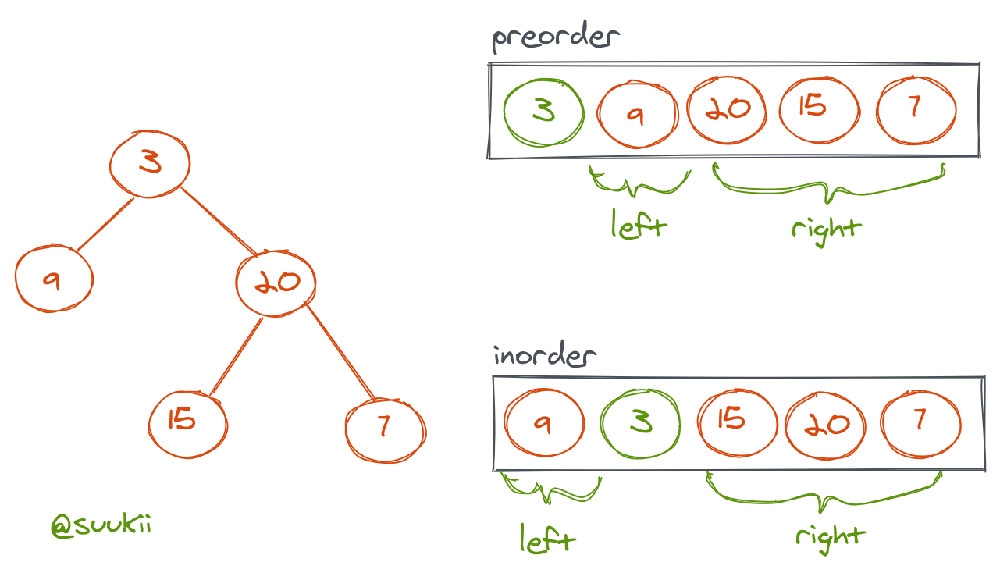

# 105.从前序与中序遍历序列构造二叉树

https://leetcode-cn.com/problems/construct-binary-tree-from-preorder-and-inorder-traversal

## 题目描述

```
根据一棵树的前序遍历与中序遍历构造二叉树。

注意:
你可以假设树中没有重复的元素。

例如，给出

前序遍历 preorder = [3,9,20,15,7]
中序遍历 inorder = [9,3,15,20,7]
返回如下的二叉树：

    3
   / \
  9  20
    /  \
   15   7
来源：力扣（LeetCode）
链接：https://leetcode-cn.com/problems/construct-binary-tree-from-preorder-and-inorder-traversal
著作权归领扣网络所有。商业转载请联系官方授权，非商业转载请注明出处。
```

## 思路

前序遍历的顺序是 `root->left->right`，也就是说在前序遍历的结果中，第一个节点就是 `root`，它的后边紧跟着左子树和右子树的前序遍历结果。

中序遍历的顺序是 `left->root->right`，也就是说在中序遍历的结果数组中，`root` 的左边是它左子树的中序遍历结果，它的右边是右子树的中序遍历结果。



结合以上两个知识点，我们可以从前序遍历结果中确定一棵二叉树的根节点，然后在中序遍历结果中找到根节点的位置(因为题目说了节点值是不重复的)，从而确定了左子树和右子树遍历结果的长度，也就能分别得到左子树和右子树的前/中序遍历结果。

好了，现在我们来看看怎么用产品经理法来解决这个问题。

**第一步**，我们的需求是要有一个 `F(preorder, inorder)` 函数， 输入一颗二叉树的前序遍历结果和中序遍历结果，返回一棵二叉树。

**第二步**，确定大问题和小问题的关系。我们的大问题是 `F(preorder, inorder)`，小问题也是显而易见的 `F(leftPreorder, leftInorder)` 和 `F(rightPreorder, rightInorder)`。至于关系，`F(preorder, inorder)` 返回的是二叉树的根节点 `root`，两个小问题分别返回的是左子树和右子树，那么只需要将 `root` 的 `left` 和 `right` 指针分别指向他们的返回值即可。

**第三步**，找到递归出口。一个出口是当遍历结果为空的时候，返回 `null`；另一个出口是当遍历结果长度为 1 的时候，也就是说这是个叶子节点，那我们就新建一个节点返回。

## 伪代码

```
buildTree(preorder, inorder):
    if isEmpty(preorder): return null
    if len(preorder) == 1: return TreeNode(preorder[0])

    root = TreeNode(preorder[0])
    root.left = buildTree(preorderOfLeft, inorderOfLeft)
    root.right = buildTree(preorderOfRight, inorderOfRight)
    return root
```

## 复杂度分析

- 时间复杂度：O(N)，N 为节点数（另外每次在中序遍历结果中查找根节点的时间复杂度不会算 🥺）
- 空间复杂度：O(N)，返回的二叉树空间复杂度是 O(N)，递归中调用栈的空间复杂度是 O(h)，h 为树的高度，所以总的空间复杂度还是 O(N)。

## 代码

Python Code

```py
# Definition for a binary tree node.
# class TreeNode(object):
#     def __init__(self, x):
#         self.val = x
#         self.left = None
#         self.right = None

class Solution(object):
    def buildTree(self, preorder, inorder):
        """
        :type preorder: List[int]
        :type inorder: List[int]
        :rtype: TreeNode
        """
        if not len(preorder): return None
        if len(preorder) == 1: return TreeNode(preorder[0])
        root = preorder[0]
        rootIndex = inorder.index(root)
        node = TreeNode(root)
        node.left = self.buildTree(preorder[1:rootIndex+1], inorder[0:rootIndex])
        node.right = self.buildTree(preorder[rootIndex+1:], inorder[rootIndex+1:])
        return node
```

JavaScript Code

```js
/**
 * Definition for a binary tree node.
 * function TreeNode(val) {
 *     this.val = val;
 *     this.left = this.right = null;
 * }
 */
/**
 * @param {number[]} preorder
 * @param {number[]} inorder
 * @return {TreeNode}
 */
var buildTree = function (preorder, inorder) {
  if (preorder.length === 0) return null
  if (preorder.length === 1) {
    return new TreeNode(preorder[0])
  }
  const root = preorder[0]
  const rootIndex = inorder.indexOf(root)

  const leftPreorder = preorder.slice(1, rootIndex + 1)
  const rightPreorder = preorder.slice(rootIndex + 1)
  const leftInorder = inorder.slice(0, rootIndex)
  const rightInorder = inorder.slice(rootIndex + 1)

  const rootNode = new TreeNode(root)
  rootNode.left = buildTree(leftPreorder, leftInorder)
  rootNode.right = buildTree(rightPreorder, rightInorder)
  return rootNode
}
```

_Originally posted by @suukii in https://github.com/leetcode-pp/91alg-1/issues/38#issuecomment-645428003_

**官方题解**
